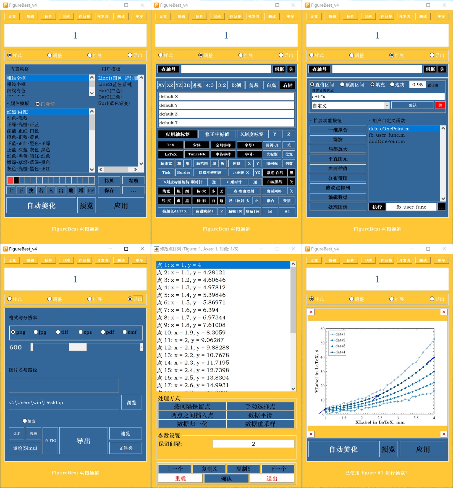
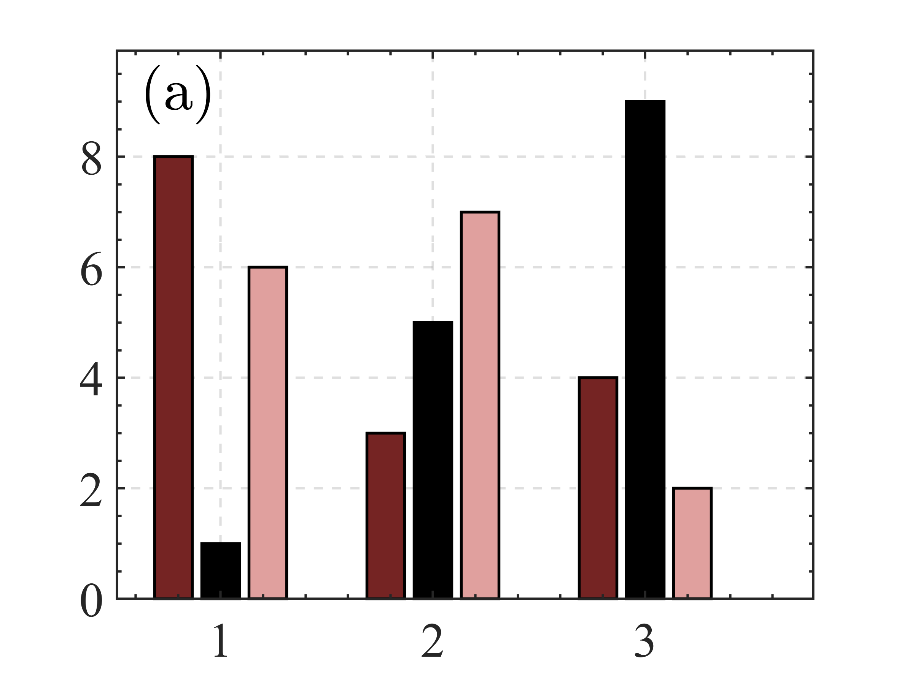
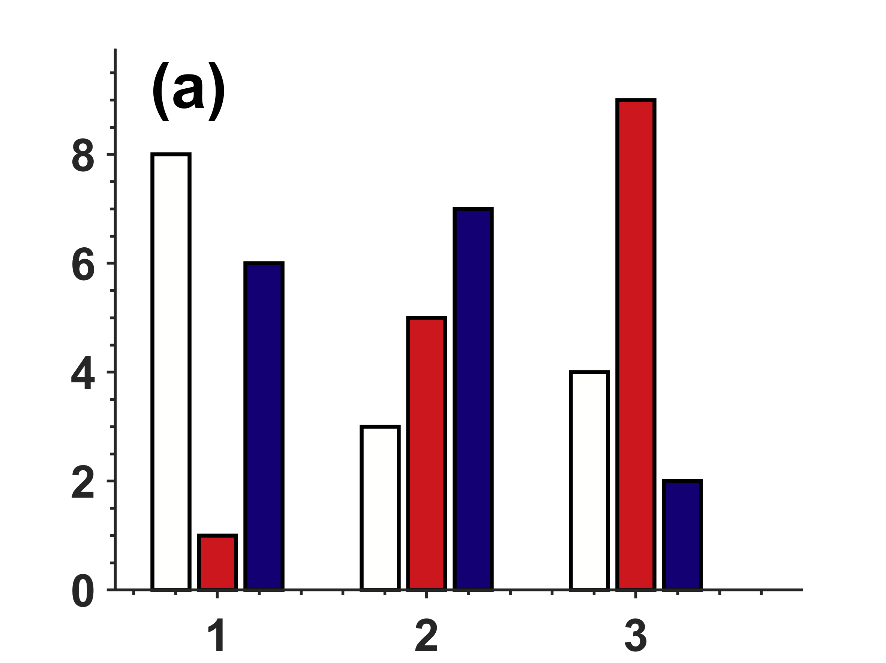
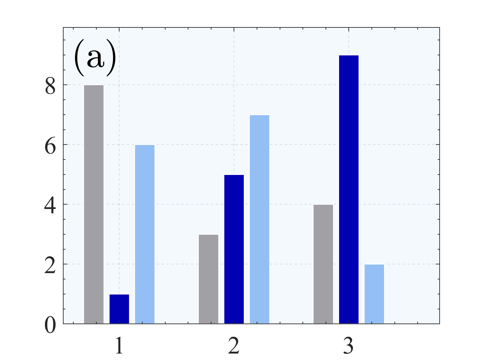
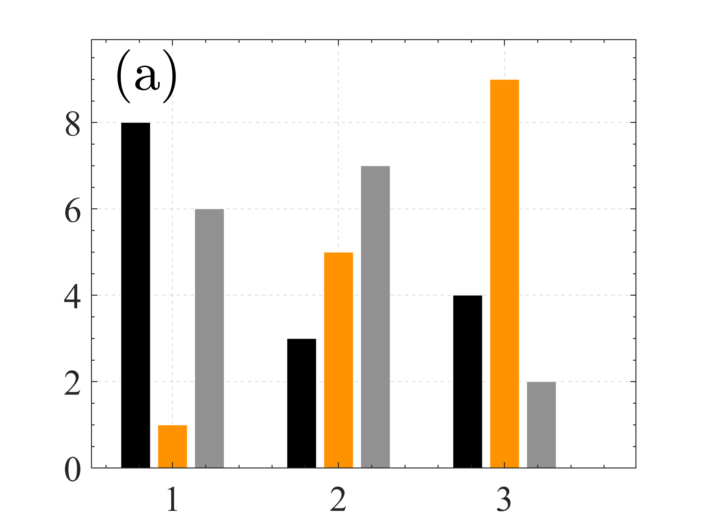
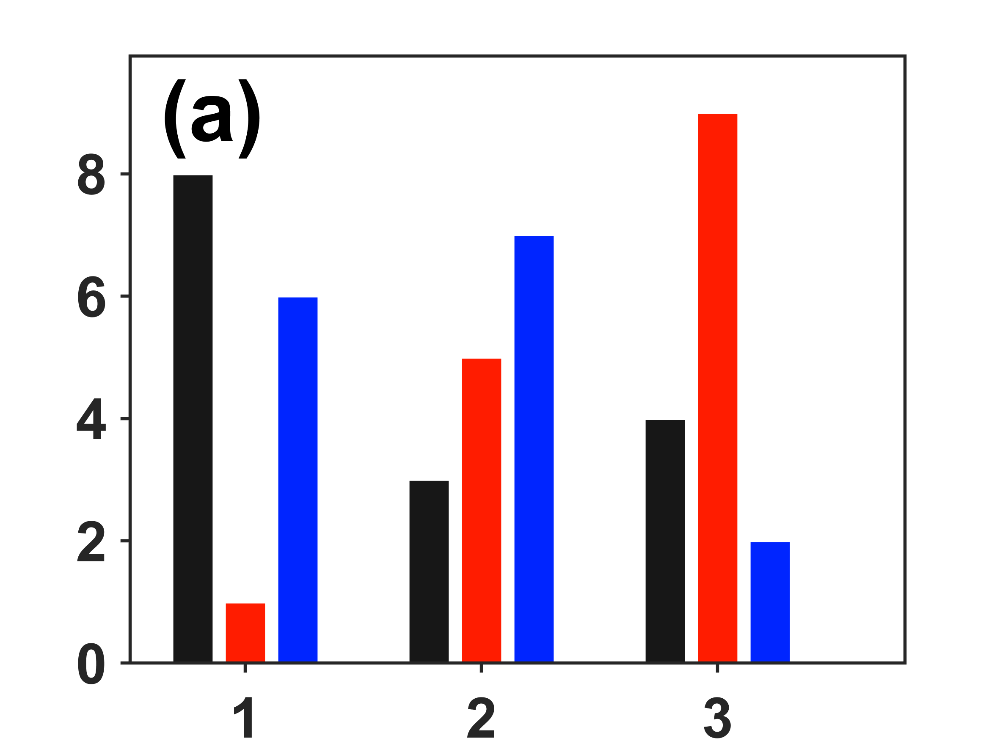
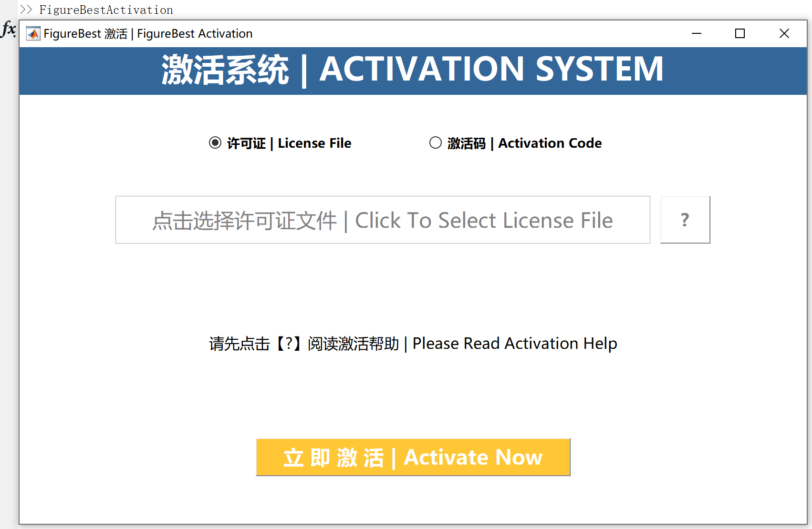
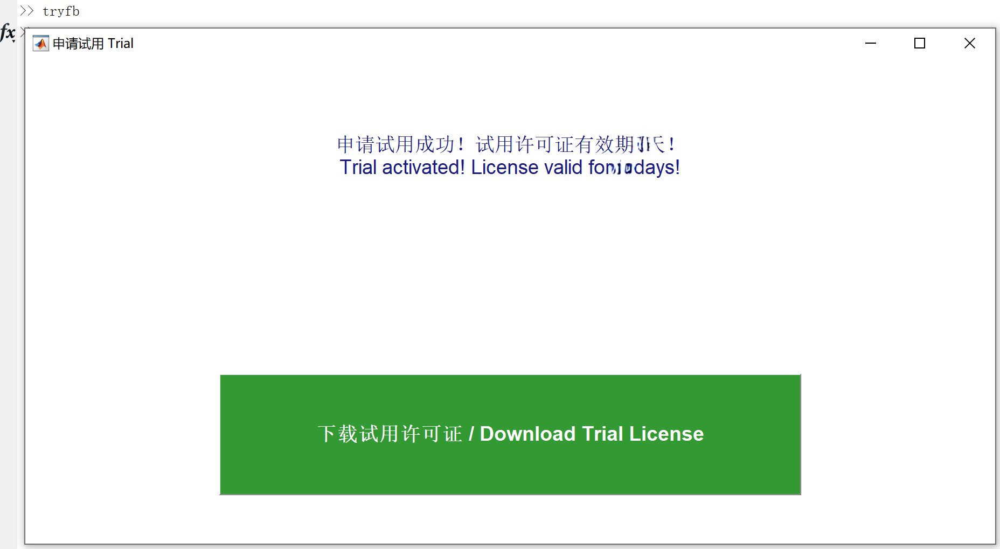

# FigureBest 说明文档 2025.04.03

---

## 一、软件简介
FigureBest（简称 FB）是一款基于 MATLAB 的科研绘图增强工具，旨在提供一键美化、风格迁移、曲面插值绘制、阴影填充、GIF 动画生成等多种数据可视化能力，帮助科研人员、工程师、学生更高效地完成高质量图表。

- **支持平台**：Windows、macOS  
- **适用版本**：MATLAB R2016a 及以上  
- **核心文件**：fb.m、clcfb.m 及相关辅助脚本

（**申请试用滑到【三、激活说明】**）

---

## 二、安装与启动

1. **解压**  
   将获得的压缩包解压到一个具有“读”和“写”权限的本地文件夹（请谨慎放置在 MATLAB 安装目录 **toolbox**、**OneDrive** 或其他限制写权限的文件夹中）。

2. **首次启动**  
   - 最好以管理员权限打开 MATLAB，切换工作目录到解压出的文件夹，运行 fb.m。  
   - 首次运行时，fb.m 会自动将此文件夹及子文件夹添加到 MATLAB 路径，如有激活需求会提示进行激活操作。
   - 也可以将解压出的文件夹出的文件夹及子文件夹添加到MATLAB搜索路径中，输入`>>fb启动`。

3. **后续使用**  
   - 只需在 MATLAB 命令行输入 fb 即可启动 FigureBest，无需再次解压或额外操作。
   - **默认每次启动都会切换工作目录**，您可以注释fb.m中的相关内容。

4. **路径管理**  
   - fb.m 默认调用 addpath(genpath(...)) 并 savepath；这样可以保证重启 MATLAB 后也能继续识别此工具。  
   - 如果想手动管理路径，可在 fb.m 中注释掉相关命令，但需要自行确保当前工作目录或 MATLAB 路径包含 FB 文件夹。

---

## 三、激活说明

FigureBest 采用许可证激活机制，具体操作和细节可查看激活框的帮助文档。简要说明如下：

1. **激活方式**

	

   - **方式一：许可证文件激活**  
     如果你已有绑定设备的 .lic 许可证文件，可直接**离线**选择此方式完成激活。
   
   - **方式二：激活码在线激活**  
     若还没有许可证文件，需要**联网**并输入激活码，系统会自动生成 .lic 绑定当前设备。

2. **注意事项**

   - 确保 FB 文件夹具有**写**权限，否则无法生成许可证文件。  
   - **激活码或许可证**的获取方式可在微信公众号“图通道”后台回复“FBV4”。  
   - 如需在本设备重复激活或其它设备上激活，则需要额外授权次数（与购买的套餐相关）。
   - 许可证一旦生成，请务必**备份**好。  

3. **免费试用**

   - 完成安装后，输入`>>tryfb`即可获得试用许可证；
   
   - 而后输入`>>fb`启动激活界面，激活方式同“方式一：许可证文件激活”。
   

---

## 四、常见注意事项

1. **MATLAB 版本**  
   - 建议在 R2016a 及以上版本运行；最好是 2019b。

2. **文件夹权限**  
   - 确认所在文件夹可写；不建议放在 Program Files 或网盘目录下。

3. **编码与字体**  
   - 若出现中文乱码，可尝试在 MATLAB [Preferences → General → Encoding] 中切换为 UTF-8 或 GBK 编码。  
   - 乱码通常不影响主要功能。

4. **路径冲突**  
   - 如果系统中已有同名脚本或旧版本 FB，须检查冲突；必要时可先删除旧版本相关路径，再启动新版本。或运行`>>clcfb`启动

5. **升级/更新**  
   - 微信公众号“图通道”后台回复“FBV4”或利用软件的更新功能。

6. **运行慢或Java 堆内存与错误**  
   - 若启动卡顿或报 java 类错误，可在 MATLAB Home → Preferences → General 中增大 Java Heap Memory。

7. **系统重装或硬件更换**  
   - 如大幅变动硬件或重装系统，可能需要重新申请激活。次数取决于所购授权类型。

---

## 五、常见问题（FAQ）

**Q1: 运行 fb 时提示“权限错误”？**  
**A1:** 说明当前目录无写权限。请把 FB 文件夹移动到一个读写无障碍的目录，如桌面或用户文件夹。

**Q2: 已装旧版用户启动报错？**  
**A2:** 请输入 clcfb 启动而不是 fb 启动。

**Q3：许可证被自动删除了？**  
**A3:** 说明这个许可证不适用于该设备，是由别的设备激活产生的。

---

## 六、许可证与免责声明

1. **许可证**  
   - .lic 文件绑定当前设备硬件，若需在多台设备使用，需要对应数量的授权次数。

2. **非商业用途**  
   - 如果不是特殊授权，禁止用于商业盈利用途的二次销售、服务或转卖。

3. **不可逆向**  
   - 禁止反编译或逆向分析核心功能脚本。

4. **免责条款**  
   - 本工具仅用于科研与教学示例，用户需自行确保绘图结果的正确性或合规性。  
   - 因用户使用不当或不可控因素导致的数据丢失、损坏，本工具及作者不承担任何责任。

---

## 七、技术支持

- **微信公众号**：图通道  
- **邮箱**：865774179@qq.com  
  （邮件中请附购买记录、订单号、所有可能需要的报错截图，并注明【FigureBest激活问题-[具体的激活码]】，否则无法受理）

---

# 感谢使用 FigureBest！

