# FigureBest使用说明文档

2026.03.30版（简介->下载->安装->免费试用）

## 一、FigureBest 软件简介
FigureBest（简称 FB）是UP主 @**图通道**基于MATLAB 开发的科研绘图美化工具，旨在提供一键美化、风格迁移、图片批处理、高清图导出等多种功能，帮助科研人员高效地完成高质量图表。

- **支持平台**：Windows、macOS
- **适用版本**：MATLAB R2016a 及以上
- **入口函数**：fb.m

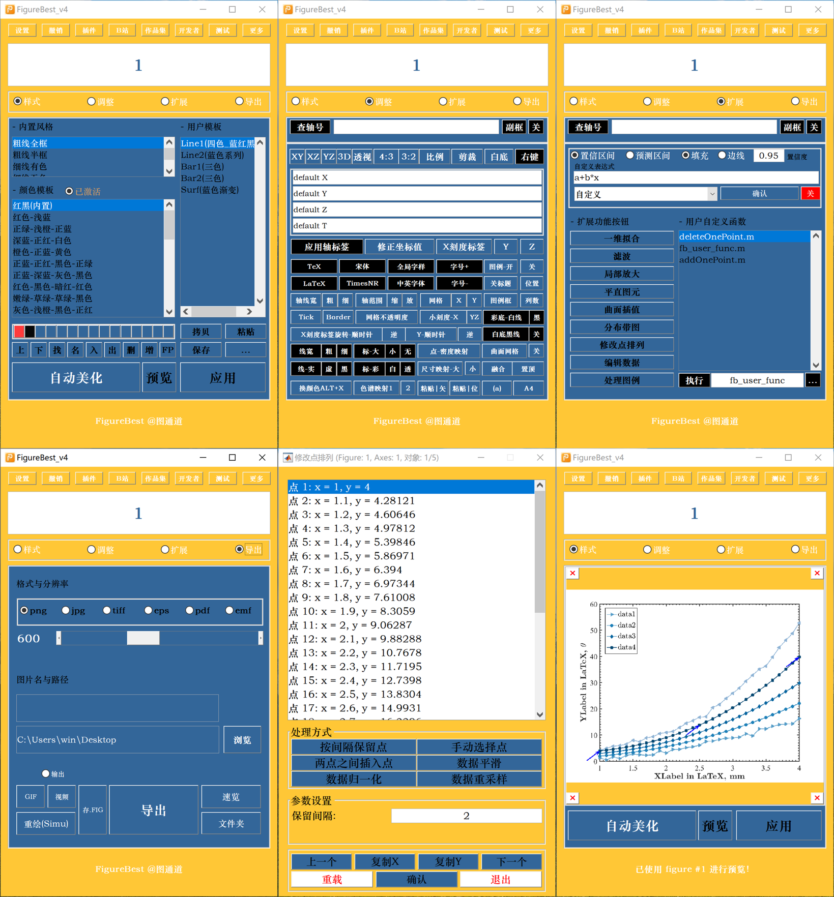


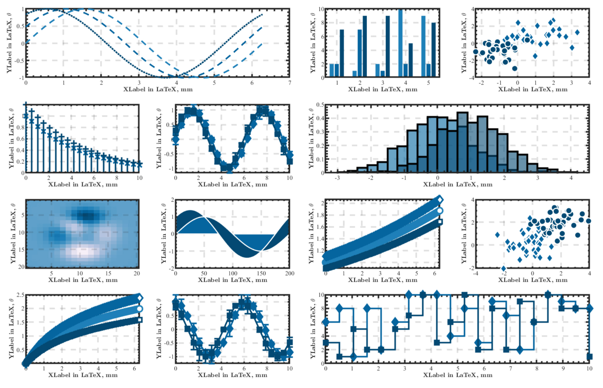

**最新版下载链接**同步在MATLAB官方社区与GITHUB，可**免费下载**。


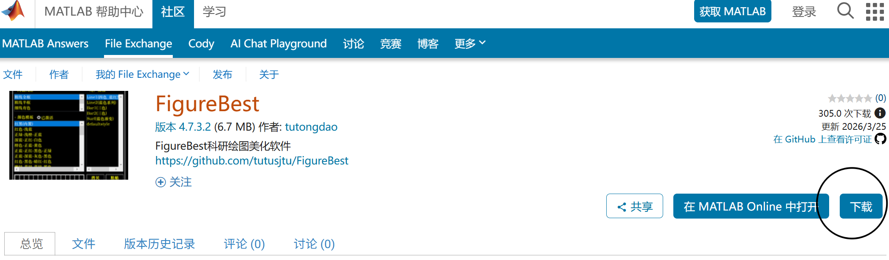

```
https://ww2.mathworks.cn/matlabcentral/fileexchange/180714-figurebest
```

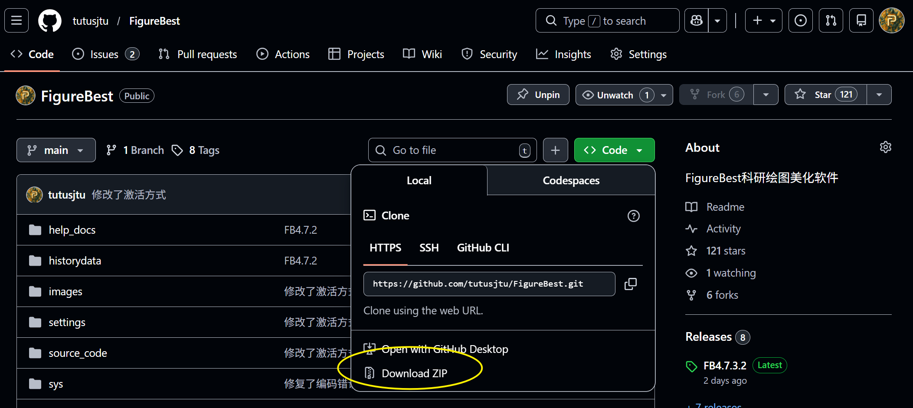

```
https://github.com/tutusjtu/FigureBest
```


## 二、安装FigureBest

### 1. 下载并解压

   - 将下载的压缩包解压到一个具有**读**和**写**权限的位置。
   - 请尽量不要放置在MATLAB安装目录 **toolbox**、**OneDrive** 或其他限制**写入**权限的文件夹中，除非您确认该文件夹是可以**写入**的。

### 2. 首次启动
   - 最好以管理员权限打开MATLAB。
   - 打开后**切换工作目录到1.中解压出的文件夹**，打开fb.m入口函数并点击运行。  
   - 首次运行时，fb.m会自动将此文件夹及子文件夹添加到 MATLAB 路径，如有激活需求会提示进行激活操作。
   - 也可以将解压出的**文件夹及子文件夹**添加到MATLAB搜索路径中，输入`>>fb`启动。
     

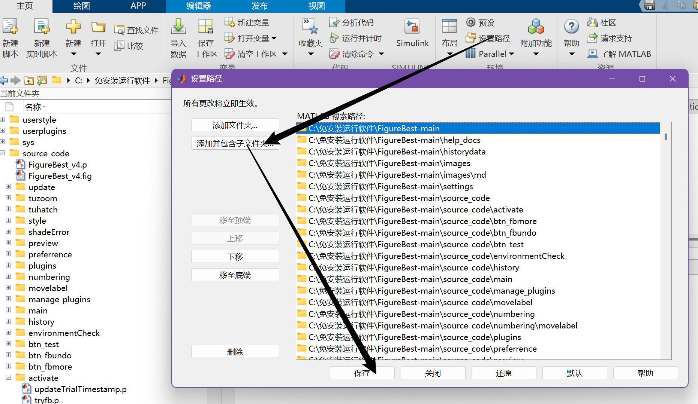

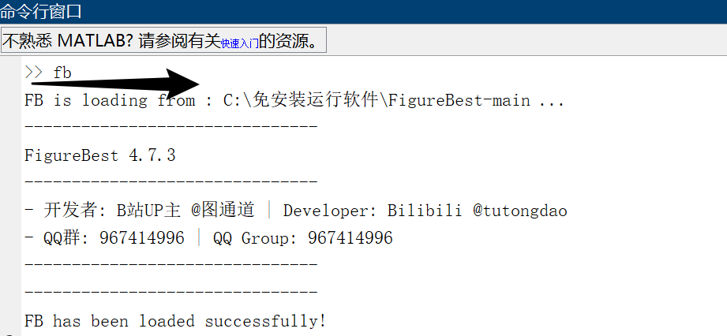


### 3. 后续启动
   - 只需在 MATLAB 命令行输入`>>fb`即可启动 FigureBest，无需再次解压或额外操作。
   - **默认每次启动都会切换工作目录，这会影响启动速度**，您可以注释fb.m中的相关内容。

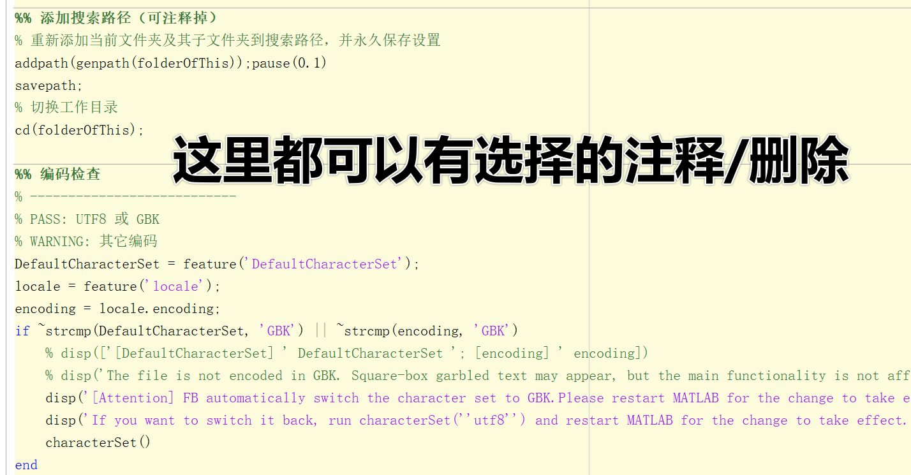

### 4. 路径管理 
- fb.m默认调用 addpath(genpath(...)) 并savepath，这样可以保证重启 MATLAB 后也能继续识别此工具。  
- 如果想手动管理路径，可在 fb.m 中注释掉相关命令，但需要自行确保当前工作目录MATLAB路径包含 FB 文件夹。
### 5. 视频教程
- 如果无法理解上述过程，请你观看安装教程视频：

```
https://www.bilibili.com/video/BV1CGo3YXEjr/?spm_id_from=333.788.videopod.sections&vd_source=e27bf25cd8017cfa45c386fde6d7e4f0&p=4
```

## 三、激活FigureBest

### 1. 在何处激活

完成FB软件安装后，输入`>>fb`即可启动软件。**如果未检测到有效许可证，会自动弹出激活提示**。

### 2. 激活前的注意事项

- 根据FigureBest版本的不同以及您购买途径的不同，主要有2种激活方式：

- **激活方式【1】** 直接扫码激活（从FB4.7.3开始引入）（**简单！推荐！**）

- **激活方式【2】** 输入外部渠道（如面包多/B站/闲鱼/图图直接发送等）获得的激活码激活（从FB4.7.0开始引入）

- 不管采用什么方式，**第一次激活需要联网，后续使用可以离线**。激活后在该设备上都可以**永久使用FB**（不支持重置操作系统），并且后续更新也不必再次激活，不必再次替换许可证。

- 不管采用什么方式，激活后都会生成本地的许可证文件，请备份好该文件。

### 3. 激活方式【1】

- 选择该方式意味着**您在看到本教程前未在任何其它官方渠道购买过FB**
- 否则都应该选择第【**2**】种激活方式。
- 在激活通道中选择【**1**】未购，按照提示完成支付即可！

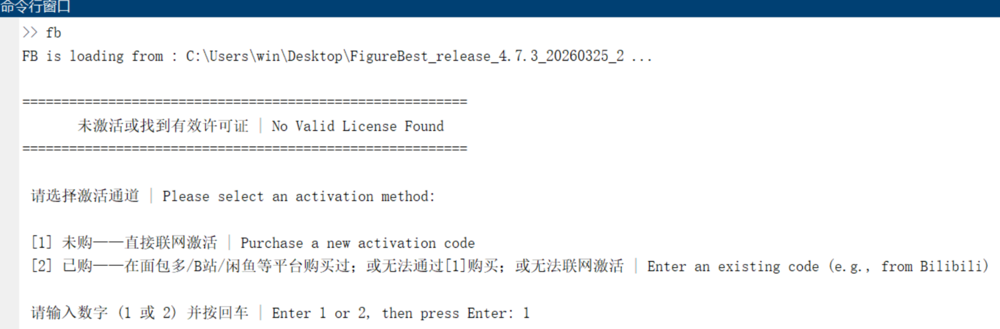

- **大致流程如下**：

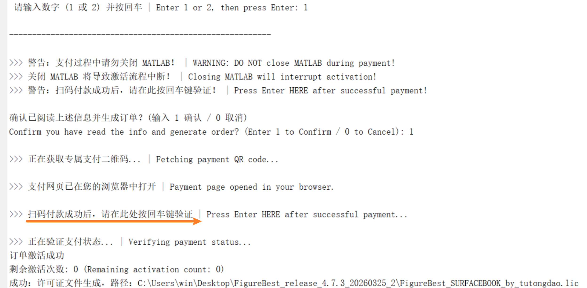


完成上述过程后重启输入`>>fb`重启即可。

### 4. 激活方式【2】

在激活通道中选择【**2**】已购，会弹出下方激活系统界面。您也可以运行`>>FigureBestActivation`手动打开该激活系统窗口。


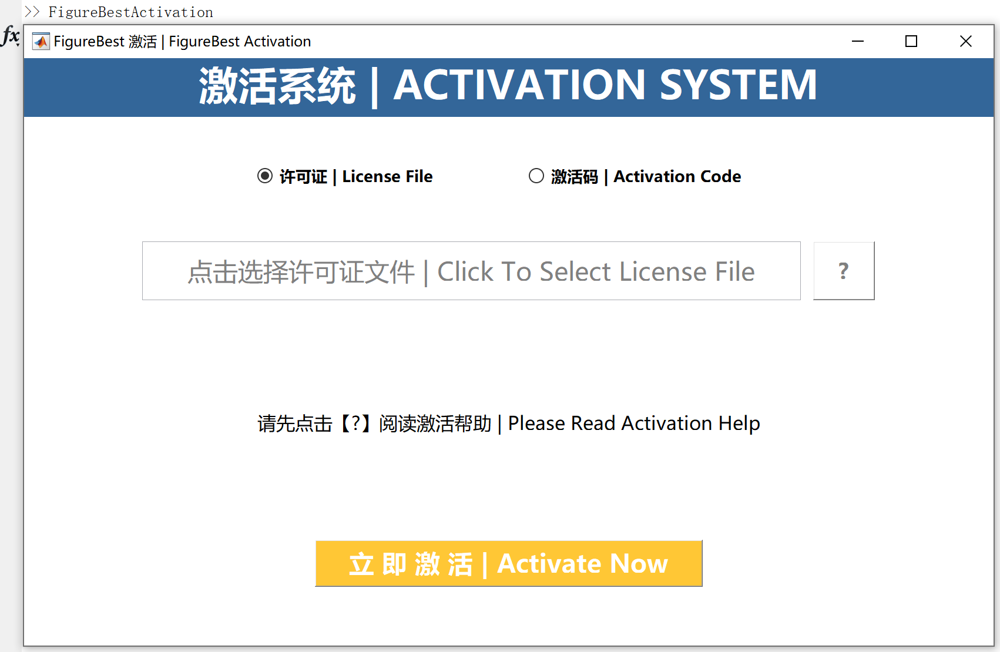


- **上方的许可证特指FB4.7系列许可证**，FB4.6系列及旧系列已经停更，不允许使用，请老用户自行**免费兑换激活码**，大致思路就是找到之前的支付单号作为激活码，通常可以激活**1**次设备。
  
- 具体查找激活码的细节可以参见【激活窗口】中的帮助【**？**】按钮，此处不再赘述。**一般来说，不会用到激活系统窗口中的许可证激活模式**，而只会用到激活码模式；除非您是特殊设备无法联网激活。帮助【？】按钮中也有指导！

## 四、免费试用FigureBest

完成FigureBest安装后，输入`>>tryfb`，即可获得试用许可证，请一步步按照流程走，将试用许可证保存到本地：

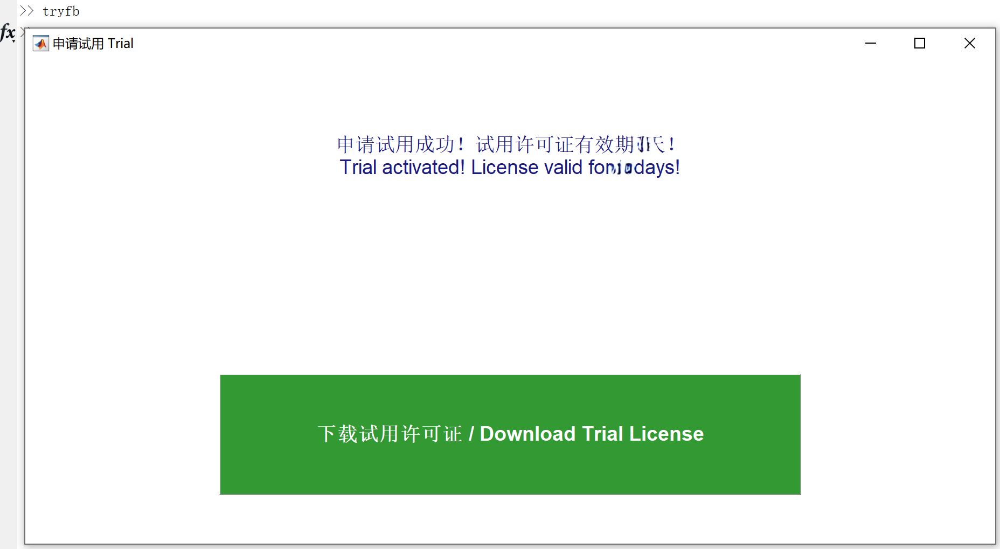


而后输入`>>fb`启动激活界面，选择**激活方式【2】**，再采用许可证模式进行激活。激活成功后重启FB即可试用。


## 五、常见注意事项

### 1. MATLAB 版本  
   - 建议在 R2016a 及以上版本运行，最好是 2019b及以上。

### 2. 文件夹权限  
   - 确认所在文件夹可写
   - 不建议放在 Program Files 或网盘目录下。

### 3. 编码与字体  
   - 若出现中文乱码，可尝试在 MATLAB 【Preferences → General → Encoding】中切换为 UTF-8 或 GBK 编码。  
   - 乱码通常不影响主要功能。

### 4. 路径冲突
   - 如果系统中已有同名脚本或旧版本 FB，须检查冲突；必要时可先删除旧版本相关路径，再启动新版本。或运行`>>clcfb`启动。

### 5. 升级/更新
   - 微信公众号“图通道”后台回复“FBV4”或利用软件右上方的更新功能。


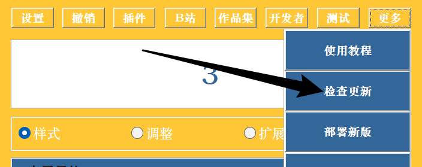

### 6. 运行慢或Java 堆内存与错误
   - 若启动卡顿或报 java 类错误，可在 MATLAB Home → Preferences → General 中增大 Java Heap Memory。

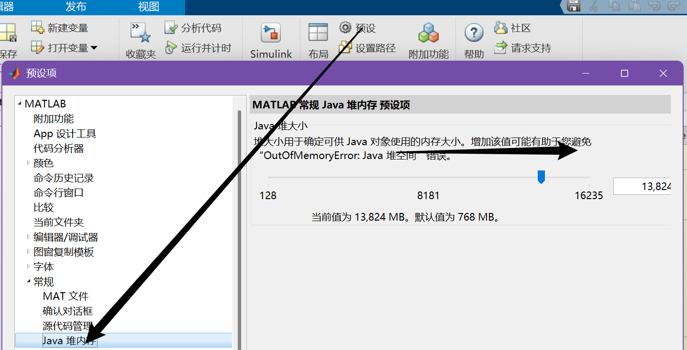


### 7. 系统重装或硬件更换  
   - 如大幅变动硬件或重装系统，需要重新购买激活次数，次数取决于所购授权类型。


## 六、常见问题

**Q1: 运行 fb 时提示“权限错误”？**  
**A1:** 说明当前目录无写权限。请把 FB 文件夹移动到一个读写无障碍的目录，如桌面或用户文件夹。

**Q2: 已装旧版用户启动报错？**  
**A2:** 请输入 >>clcfb 启动而不是 >>fb 启动。

**Q3：许可证被自动删除了？** 
**A3:** 说明这个许可证不适用于该设备，是由别的设备激活产生的。

---

## 七、许可证与免责声明

### 1. 许可证  
   - .lic 文件绑定当前设备硬件，若需在多台设备使用，需要对应数量的授权次数。

### 2. 非商业用途  
   - 如果不是特殊授权，禁止用于商业盈利用途的二次销售、服务或转卖。

### 3. 不可逆向  
   - 禁止反编译或逆向分析核心功能脚本。

### 4. 免责条款  
   - 本工具仅用于科研与教学示例，用户需自行确保绘图结果的正确性或合规性。  
   - 因用户使用不当或不可控因素导致的数据丢失、损坏，本工具及作者不承担任何责任。


## 八、技术支持

- **微信公众号**：图通道
- **Bilibili**：图通道
- **邮箱**：tutongdao@qq.com  

**邮件主题**：
【FigureBest激活问题+在此处填写您的激活码+必要的问题简述】
**邮件正文**：
请详细说明问题，并附购买记录、订单号、详细的报错和运行截图等内容，否则无法受理。

**感谢您使用FigureBest!**
